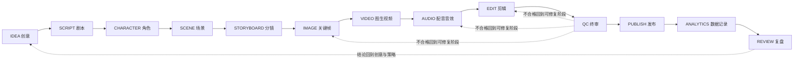

# SHORT_VIDEO_PIPELINE — 标准短视频生产流程（框架 v1）

状态：Phase 0 框架稿，**未开始正式生产**。
适用范围：抖音 / 快手竖屏短视频；短剧后续复用同一管线（见 `accounts/short_drama/`）。

## 生产原则

1. 禁止默认走“纯文字 → 视频 → 不满意 → 无限抽卡”。
2. 生产顺序固定：创意 → 剧本 → 角色设定 → 角色参考图 → 场景参考图 → 分镜 → 关键帧 → 图生视频 → 配音/音效 → 剪辑 → 成片。
3. 每个阶段设质量门槛（Gate）：未通过不允许进入下一阶段；QC 不合格回到上一可修复阶段，而不是盲目重抽。
4. 生成类阶段结束后，把调用记入 `analytics/ai_costs.csv`；作品发布后把数据记入 `database/content_experiments.sqlite`。
5. 成本口径：**最终可用作品成本 =（总生成成本 + 失败成本）/ 可用成片数**。
6. PUBLISH 必须人工确认；Phase 0 期间整体禁止发布。

## 流程总览

## 阶段定义

每个阶段记录：输入 / 输出 / 工具 / 预计成本 / 质量检查 / 失败处理。

### IDEA 创意

- 输入：账号定位、选题方向、平台热点、参考资料（`references/`）
- 输出：创意卡片（题材、目标人群、传播钩子、一句话卖点），写入 `strategy/experiments/` 或 `projects/<id>/idea.md`
- 工具：ChatGPT 策略讨论、content-strategy-agent、douyin/kuaishou-content 技能
- 预计成本：0（文本）
- 质量检查：是否符合账号定位？3 秒能否讲清？是否有传播钩子？
- 失败处理：直接淘汰，不进 SCRIPT

### SCRIPT 剧本

- 输入：创意卡片
- 输出：`scripts/<id>.md`（结构、Hook、对白、旁白、字幕稿、目标时长）
- 工具：ai-screenwriter 技能、screenwriter-agent、ChatGPT
- 预计成本：0（文本）
- 质量检查：Hook 是否前置？节奏是否紧凑？是否可执行？
- 失败处理：重写不超过 2 次；仍不达标回 IDEA

### CHARACTER 角色

- 输入：剧本角色清单
- 输出：`characters/<id>.md` 设定卡（外貌 / 性格 / 声音 / 服装）+ 参考图（`assets/images/character_refs/`）
- 工具：ai-film-director 技能、视觉 agent、云端生图 API
- 预计成本：生图费用（记入 `analytics/ai_costs.csv`）
- 质量检查：与剧本一致；参考图可复现（正面 / 侧面 / 表情）
- 失败处理：调整提示词与参考图；连续 3 次失败暂停，审查方案（换模型 / 换画风）

### SCENE 场景

- 输入：剧本场景清单 + 角色参考图
- 输出：`scenes/<id>.md` 场景设定（环境 / 光线 / 色调 / 氛围）+ 参考图（`assets/images/scene_refs/`）
- 工具：ai-film-director 技能、视觉 agent、云端生图 API
- 预计成本：生图费用（记入账本）
- 质量检查：与剧本一致；同一场景多角度可复现
- 失败处理：同 CHARACTER

### STORYBOARD 分镜

- 输入：剧本 + 角色 / 场景参考图
- 输出：`storyboards/<id>.md` 分镜表（镜号 / 景别 / 运镜 / 时长 / 画面描述 / 对白 / 音效）
- 工具：storyboard-generator 技能、director-agent
- 预计成本：0（文本）
- 质量检查：每镜有画面描述；总时长 ≈ 目标时长
- 失败处理：回写修改；分镜不合理不许进入生图

### IMAGE 关键帧（图生图）

- 输入：分镜表 + 角色 / 场景参考图
- 输出：`assets/images/projects/<id>/` 关键帧
- 工具：云端生图 API（或未来 ComfyUI 云端）；用参考图提升一致性
- 预计成本：图片费用（记入账本）
- 质量检查：角色 / 场景一致性、构图、无废帧；生成次数有上限（按阶段预算）
- 失败处理：定位是提示词 / 参考图 / 模型问题后针对性修复；禁止无脑重抽

### VIDEO 图生视频

- 输入：关键帧（+ 运镜描述）
- 输出：`assets/videos/projects/<id>/raw/`
- 工具：云端视频生成 API
- 预计成本：视频费用（记入账本）
- 质量检查：动作自然、一致性保持、时长匹配分镜
- 失败处理：重试上限（建议 2-3 次 / 镜）；超限回 STORYBOARD / IMAGE 修输入

### AUDIO 配音 / 音效

- 输入：剧本对白稿、分镜音效说明
- 输出：`assets/audio/projects/<id>/`（TTS + 音效 / 音乐）
- 工具：TTS API、本地 faster-whisper 校验、`assets/music/` 素材
- 预计成本：TTS 费用
- 质量检查：与画面时长对位、音质、口型（如适用）
- 失败处理：调整 TTS 参数重跑；仍失败换引擎

### EDIT 剪辑

- 输入：raw 视频 + 音频 + 字幕稿
- 输出：`assets/videos/projects/<id>/cut/` 成片草稿
- 工具：ffmpeg、`tools/video_analysis.py`（节奏 / 时长校验）、字幕脚本
- 预计成本：0（本地）
- 质量检查：时长、节奏、字幕、转场、音画同步
- 失败处理：局部重剪，不重生成

### QC 终审

- 输入：成片草稿
- 输出：通过 / 修改意见
- 工具：`tools/video_analysis.py` report、主 Codex + 人工审核
- 质量检查：平台规格（9:16、时长、体积、清晰度）；合规（AI 内容标识按平台要求标注，不做规避）
- 失败处理：回 EDIT 或更早阶段；不通过绝不发布

### PUBLISH 发布

- 输入：终审成片 + 标题 / 话题 / 封面
- 输出：`projects/<id>/publish.md`（发布记录：时间 / 平台 / 文案 / 话题）
- 工具：人工发布（**禁止自动发布**，禁止登录 / 修改平台账号）
- 预计成本：0
- 质量检查：人工确认账号、时间、标题、封面
- 失败处理：不发布，回 QC

### ANALYTICS 数据记录

- 输入：平台后台数据（由用户提供）
- 输出：`database/content_experiments.sqlite` 记录；`analytics/ai_costs.csv` 核对
- 工具：`scripts/content_db.py`
- 失败处理：数据缺失标记为空，不编造

### REVIEW 复盘

- 输入：内容实验库数据
- 输出：`analytics/` 复盘报告（规律与建议）
- 工具：content-data-analyst 技能、data-analyst-agent
- 失败处理：样本不足 → 继续积累，不下结论

## 目录与阶段代号

| 阶段 | 输出目录 |
| --- | --- |
| SCRIPT | scripts/ |
| CHARACTER | characters/ + assets/images/character_refs/ |
| SCENE | scenes/ + assets/images/scene_refs/ |
| STORYBOARD | storyboards/ |
| IMAGE / VIDEO / AUDIO / EDIT | assets/images|videos|audio/projects/<id>/ |
| 成片 | outputs/<platform>/ |
| 数据 | database/ + analytics/ |

## 当前状态

Phase 0 仅保留框架。**不启动正式作品生产**，等待用户与 ChatGPT 下达下一阶段任务。
